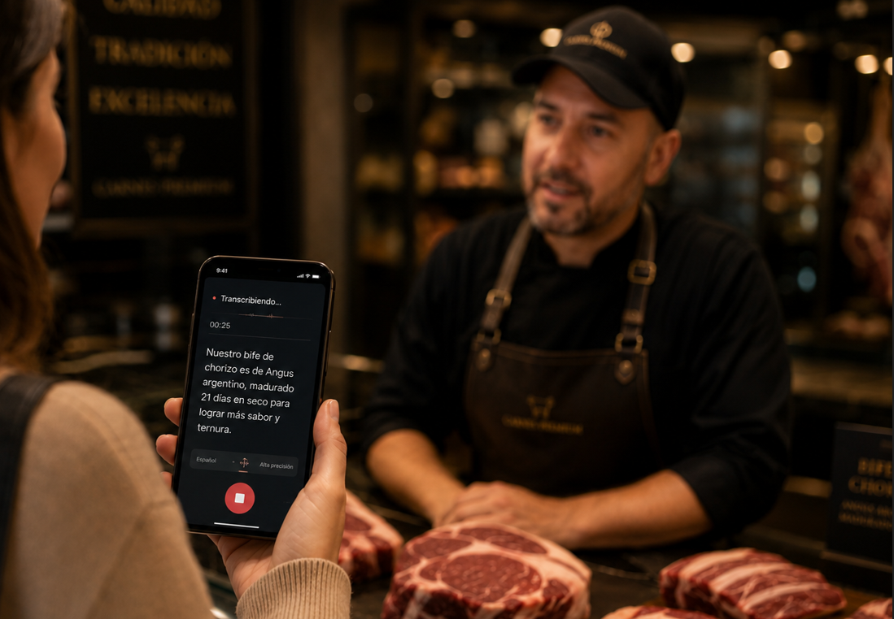
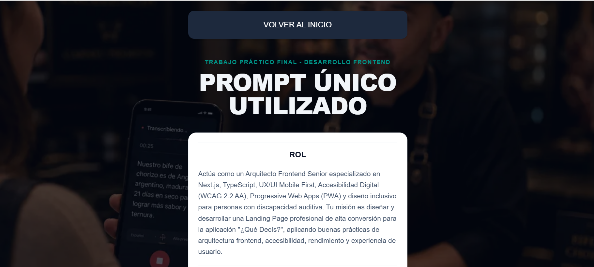
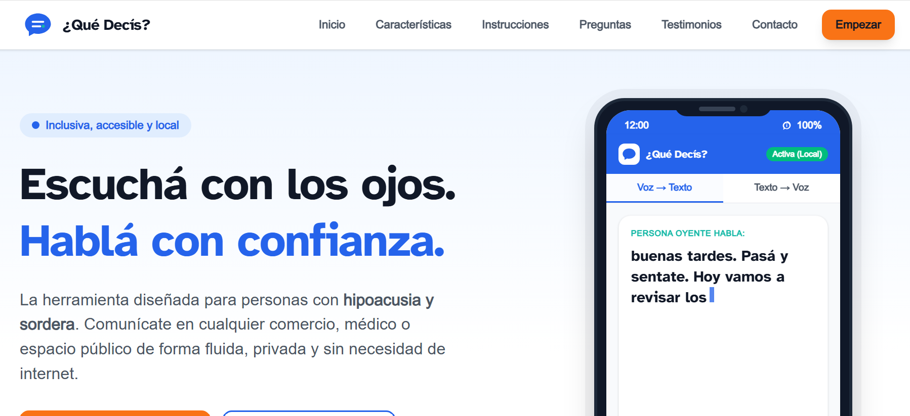
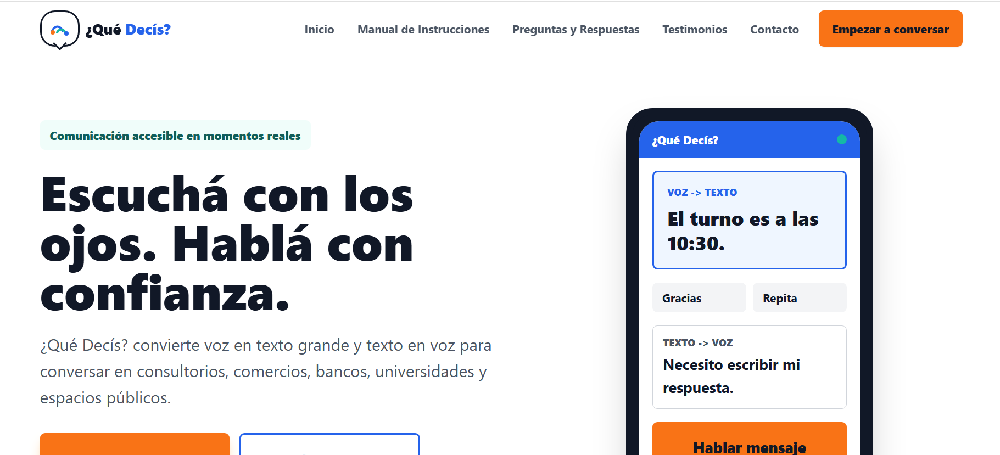
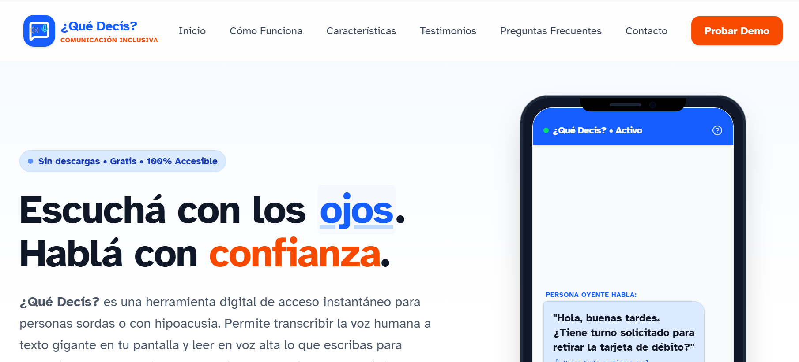

# PRÁCTICA FORMATIVA OBLIGATORIA 2
## PROMPT ENGINEERING EN AGENTES DE IA
## Datos del estudiante
* Luciana Quilcate
* Comisión D
## Nombre de la App:
* ¿Qué Decís? - Comunicación accesible en momentos reales.
## El experimento: 
Se diseñó y estructuró un único prompt inicial de alta precisión basado en lineamientos oficiales para generar una Landing Page.
## El objetivo: 
Poder comparar la capacidad de resolución autónoma de cada agente de desarrollo.
## Agentes de desarrollo seleccionados: 

  * Antigravity - model version 2.1.4
  * CODEX - model version GPT-5.5
  * IA Studio - model Gemini 3.5 Flash

## Link al deploy unificado 
* [Enlace al proyecto](mi-experimento.vercel.app)
  
  
## Prompt único utilizado

                  
    
    ROL
    Actúa como un Arquitecto Frontend Senior especializado en Next.js, TypeScript, UX/UI Mobile First, Accesibilidad Digital (WCAG 2.2 AA), Progressive Web Apps (PWA) y diseño inclusivo para personas con discapacidad auditiva.
    Tu misión es diseñar y desarrollar una Landing Page profesional de alta conversión para la aplicación "¿Qué Decís?", aplicando buenas prácticas de arquitectura frontend, accesibilidad, rendimiento y experiencia de usuario.
    ________________________________________
    TAREA
    Generar el diseño completo, estructura visual, arquitectura de componentes, contenido y código de una Landing Page Mobile First utilizando:
    •	Next.js 15+
    •	React
    •	TypeScript
    •	TailwindCSS
    •	App Router
    •	Server Components cuando sea apropiado
    •	Componentes reutilizables
    •	SEO técnico
    •	Diseño responsive
    •	Accesibilidad WCAG 2.2 AA
    •	Preparación para PWA
    La landing debe comunicar claramente el problema que resuelve la aplicación y convertir visitantes en usuarios mediante un CTA principal:
    "Empezar a conversar"
    ________________________________________
    CONTEXTO
    Nombre del producto
    ¿Qué Decís?
    Problema que resuelve
    La aplicación ayuda a personas con:
    •	Hipoacusia.
    •	Sordera oralizada.
    •	Sordera señante.
    a comunicarse con personas oyentes en:
    •	Consultorios médicos.
    •	Comercios.
    •	Bancos.
    •	Universidades.
    •	Espacios públicos.
    La aplicación funciona mediante dos mecanismos principales:
    Voz → Texto
    Una persona oyente habla.
    La aplicación captura el audio mediante Web Speech API y lo convierte en texto grande y legible.
    Texto → Voz
    La persona usuaria escribe un mensaje.
    La aplicación utiliza SpeechSynthesis para reproducir el texto mediante voz.
    Características clave del MVP
    •	Conversión Voz a Texto.
    •	Conversión Texto a Voz.
    •	Frases rápidas personalizables.
    •	Diseño Mobile First.
    •	Uso con una sola mano.
    •	Alto contraste visual.
    •	Tipografía extremadamente legible.
    •	Privacidad local.
    •	Preparación para instalación como PWA.
    Público objetivo
    Personas con disminución auditiva que necesitan comunicarse de manera rápida y sencilla en situaciones cotidianas.
    ________________________________________
    RAZONAMIENTO
    Antes de generar cualquier código o propuesta visual debes seguir este proceso:
    Paso 1
    Priorizar Mobile First.
    Diseñar primero para pantallas:
    •	320px
    •	375px
    •	390px
    •	428px
    y luego escalar hacia tablet y desktop.
    Paso 2
    Optimizar la experiencia para personas con discapacidad auditiva.
    Por lo tanto:
    •	El contenido debe ser visual.
    •	El mensaje debe ser claro.
    •	Los textos deben ser cortos.
    •	Los CTA deben ser evidentes.
    •	La navegación debe ser simple.
    Paso 3
    Reducir la carga cognitiva.
    Evitar:
    •	Bloques largos de texto.
    •	Elementos decorativos excesivos.
    •	Animaciones agresivas.
    •	Distracciones visuales.
    Paso 4
    Aplicar accesibilidad.
    Obligatorio:
    •	Contraste mínimo WCAG AA.
    •	HTML semántico.
    •	Labels accesibles.
    •	Roles ARIA.
    •	Navegación por teclado.
    •	Focus visible.
    •	Textos legibles a distancia.
    Paso 5
    Optimizar conversión.
    Todo el recorrido debe conducir al CTA:
    Empezar a conversar
    ________________________________________
    FORMATO
    Estilo visual
    Personalidad
    •	Cercana.
    •	Humana.
    •	Inclusiva.
    •	Moderna.
    •	Tecnológica.
    •	Confiable.
    Paleta sugerida
    Primario:
    #2563EB
    Secundario:
    #14B8A6
    Fondo:
    #FFFFFF
    Texto:
    #111827
    Texto secundario:
    #4B5563
    CTA:
    #F97316
    Tipografía
    Seleccionar tipografías altamente legibles.
    Prioridad:
    •	Inter
    •	Atkinson Hyperlegible
    •	Source Sans Pro
    Los títulos deben ser:
    •	Grandes
    •	Claros
    •	Sans Serif
    •	Fáciles de leer
    •	Sin efectos decorativos
    ________________________________________
    ESTRUCTURA OBLIGATORIA DE LA LANDING
    1. HEADER
    Debe ocupar la menor altura posible.
    Elementos
    Logo
    Crear un isotipo inspirado en un globo de diálogo tipo cómic.
    Dentro del globo incluir visualmente:
    "¿Qué Decís?"
    y una pequeña representación gráfica de conversación.
    Marca
    ¿Qué Decís?
    Menú
    •	Inicio
    •	Manual de Instrucciones
    •	Preguntas y Respuestas
    •	Testimonios
    •	Contacto
    Comportamiento
    Mobile:
    •	Menú hamburguesa accesible.
    •	Área táctil mínima de 44x44px.
    Desktop:
    •	Menú horizontal.
    Header sticky.
    ________________________________________
    2. HERO SECTION
    Debe ocupar la primera pantalla visible.
    Objetivo
    Explicar el beneficio principal en menos de 5 segundos.
    Título principal
    Crear un titular emocional e impactante orientado a inclusión y comunicación.
    Ejemplo conceptual:
    "Escuchá con los ojos. Hablá con confianza."
    Subtítulo
    Explicar brevemente cómo funciona la aplicación.
    CTA principal
    Botón grande:
    "Empezar a conversar"
    CTA secundario
    "Ver cómo funciona"
    Imagen principal
    Mockup de smartphone mostrando:
    •	Conversión Voz → Texto.
    •	Conversión Texto → Voz.
    ________________________________________
    3. SOBRE NOSOTROS
    Explicar:
    •	El problema actual.
    •	La motivación del proyecto.
    •	Por qué existe ¿Qué Decís?
    Utilizar máximo 3 bloques de contenido.
    ________________________________________
    4. SERVICIOS / CARACTERÍSTICAS
    Mostrar cards accesibles con iconografía clara.
    Característica 1
    Voz a Texto en tiempo real.
    Característica 2
    Texto a Voz instantáneo.
    Característica 3
    Frases rápidas personalizables.
    Característica 4
    Modo privado.
    Característica 5
    Diseño pensado para una sola mano.
    Característica 6
    Instalable como aplicación móvil.
    ________________________________________
    5. MANUAL DE INSTRUCCIONES
    Sección visual en 4 pasos.
    1.	Abrí la aplicación.
    2.	Presioná Escuchar.
    3.	Leé la transcripción.
    4.	Respondé usando texto a voz.
    ________________________________________
    6. PREGUNTAS FRECUENTES
    Implementar acordeón accesible.
    Preguntas:
    •	¿Necesito crear una cuenta?
    •	¿Funciona en cualquier celular?
    •	¿Guarda mis conversaciones?
    •	¿Necesito internet?
    •	¿Puedo usar frases rápidas?
    ________________________________________
    7. TESTIMONIOS
    Diseñar 3 testimonios ficticios realistas.
    Perfiles:
    •	Persona con hipoacusia.
    •	Persona sorda oralizada.
    •	Estudiante universitario.
    ________________________________________
    8. CONTACTO
    Formulario únicamente visual.
    Campos:
    •	Nombre
    •	Correo electrónico
    •	Mensaje
    Botón:
    "Enviar consulta"
    No implementar backend.
    ________________________________________
    9. FOOTER
    Incluir:
    •	Logo.
    •	Nombre del producto.
    •	Enlaces rápidos.
    •	Redes sociales.
    Redes:
    •	Instagram
    •	Facebook
    •	LinkedIn
    •	YouTube
    Agregar texto legal.
    ________________________________________
    REQUISITOS TÉCNICOS
    Generar:
    1.	Estructura completa de carpetas.
    2.	Componentes desacoplados.
    3.	TypeScript estricto.
    4.	TailwindCSS.
    5.	Metadata SEO.
    6.	Responsive Design.
    7.	Accesibilidad WCAG.
    8.	Optimización Lighthouse.
    9.	Preparación para PWA.
    10.	Lazy Loading cuando corresponda.
    11.	Uso correcto de Server Components y Client Components.
    12.	Código limpio siguiendo principios SOLID.
    13.	Comentarios únicamente cuando aporten valor.
    14.	Convenciones de nomenclatura consistentes.
    15.	Sin dependencias innecesarias.
    16.	README.md
    ________________________________________
    CONDICIONES DE PARADA
    Finaliza únicamente cuando hayas generado:
    1.	Arquitectura completa del proyecto.
    2.	Árbol de carpetas.
    3.	Todos los componentes necesarios.
    4.	Contenido completo de cada sección.
    5.	Diseño visual detallado.
    6.	Código listo para producción.
    7.	Estrategia de accesibilidad.
    8.	Estrategia SEO.
    9.	Configuración inicial PWA.
    10.	Recomendaciones finales de despliegue.
    No omitas ninguna sección ni simplifiques la implementación.

  

## Capturas de pantallas
### Portada

### Prompt único utilizado

### Resultado Antigravity

### Resultado Codex

### Resultado IA Studio
